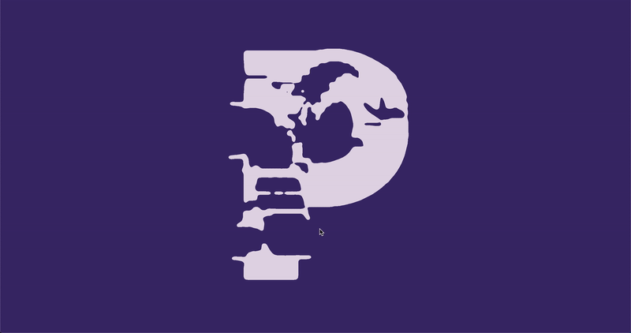
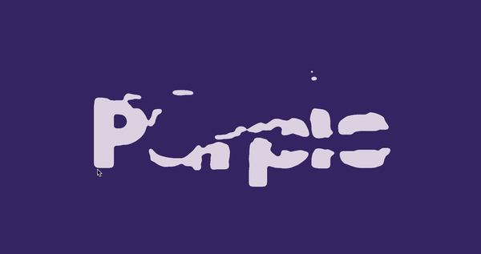

# Kinetic-Typography-1
Kinetic Typography with PIXI, html5 method.
Projects for Practicing Creative, Interactive Coding (with YouTube tutorials)

[GO TO THE PAGE>>](https://yooheana.github.io/Kinetic-Typography-1/)

[

Details
-------------
* your mouse movement can sprinkle the letters
* keep the pointer outside for few seconds, then the words would be original
      
      
## Built With

* JavaScript Canvas
